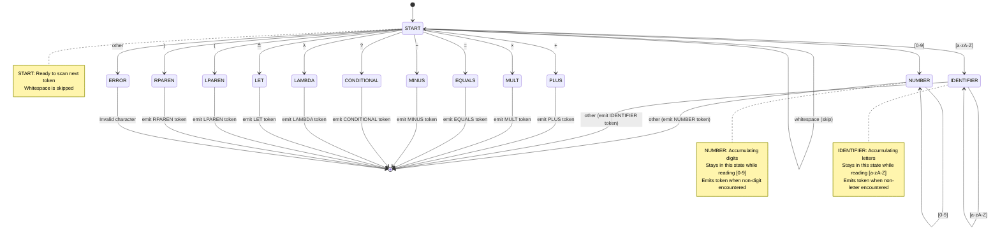

    # MiniLisp Lexer DFA (Deterministic Finite Automaton)

This diagram shows the state transitions for the MiniLisp lexical analyzer.

## State Descriptions

### START
- **Initial state**: Beginning of new token scan
- **Actions**: 
  - Skip whitespace characters
  - Transition based on first character class
  - Return to START after emitting single-character tokens

### NUMBER (Accepting State)
- **Purpose**: Accumulate consecutive digits
- **Entry**: First digit [0-9] encountered
- **Loop**: Continue reading digits [0-9]
- **Exit**: Non-digit encountered → emit NUMBER token, return character to input

### IDENTIFIER (Accepting State)
- **Purpose**: Accumulate consecutive letters
- **Entry**: First letter [a-zA-Z] encountered
- **Loop**: Continue reading letters [a-zA-Z]
- **Exit**: Non-letter encountered → emit IDENTIFIER token, return character to input

### Single-Character States (All Accepting)
- **PLUS, MULT, EQUALS, MINUS, CONDITIONAL, LAMBDA, LET, LPAREN, RPAREN**
- **Purpose**: Immediately recognize and emit single-character tokens
- **Entry**: Specific character matched
- **Exit**: Immediately emit token and return to START

### ERROR
- **Purpose**: Handle invalid/unexpected characters
- **Action**: Report lexical error with character position

## Transition Table

| Current State | Input Character | Next State | Action |
|--------------|-----------------|------------|--------|
| START | [0-9] | NUMBER | Start accumulating number |
| START | [a-zA-Z] | IDENTIFIER | Start accumulating identifier |
| START | + | PLUS | Emit PLUS token |
| START | × | MULT | Emit MULT token |
| START | = | EQUALS | Emit EQUALS token |
| START | − | MINUS | Emit MINUS token |
| START | ? | CONDITIONAL | Emit CONDITIONAL token |
| START | λ | LAMBDA | Emit LAMBDA token |
| START | ≜ | LET | Emit LET token |
| START | ( | LPAREN | Emit LPAREN token |
| START | ) | RPAREN | Emit RPAREN token |
| START | whitespace | START | Skip (no token) |
| START | other | ERROR | Report error |
| NUMBER | [0-9] | NUMBER | Continue accumulating |
| NUMBER | other | START | Emit NUMBER, reprocess char |
| IDENTIFIER | [a-zA-Z] | IDENTIFIER | Continue accumulating |
| IDENTIFIER | other | START | Emit IDENTIFIER, reprocess char |

## Key Properties

1. **Deterministic**: Exactly one transition per (state, input) pair
2. **Minimal Lookahead**: Decisions made on current character only
3. **Greedy Matching**: Multi-character tokens consume maximum valid characters
4. **Efficient**: O(n) time complexity where n is input length